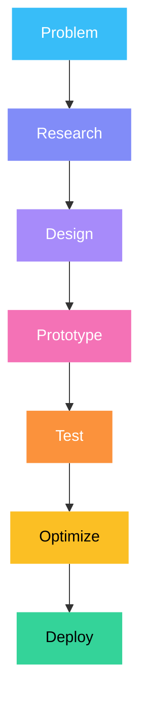

<p align="center">
  
</p>

<h1 align="center">Seth</h1>

<h3 align="center">Systems Architect • Embedded Systems Engineer • Robotics Developer</h3>

<p align="center">
  <em>Building reliable systems through continuous iteration.</em>
</p>

<p align="center">
  
</p>

<p align="center">
  
</p>

##  About

I design embedded systems that bridge hardware and software with an emphasis on reliability, maintainability, and performance. My projects range from autonomous robotics and embedded firmware to PCB design, mechanical design, and engineering simulation.

I believe engineering is an iterative process where careful measurement, thoughtful design, and continuous refinement produce dependable systems.

---

##  Technical Stack

**Embedded Systems**


**Programming**


**CAD**


**Development**


---

##  Engineering Domains

<p>


<br/>


</p>

---

<p align="center">
  
</p>

##  Featured Projects

###  High-Speed Line Tracing Robot
- Multi-sensor TCRT5000 array
- High-speed PID control
- ESP32 / STM32 implementations
- Modular electronics

###  Smart Modular Power Distribution
- ESP32 powered
- Firebase integration
- MIT App Inventor companion application
- Modular relay architecture

###  Embedded Controller Boards
- Custom KiCad PCBs
- Compact embedded control
- Hardware-software co-design

---

##  Engineering Principles

```text
Reliability > Complexity
Performance > Features
Measurement > Assumptions
Iteration > Perfection
Systems > Components
```

---

##  Development Workflow



---

##  Philosophy

```cpp
class Engineering {
public:
    void Develop() {
        while (!System.IsReliable()) {
            Design();
            Prototype();
            Test();
            Optimize();
        }
    }
};
```

---

##  GitHub Statistics

<p align="center">


</p>

<p align="center">

</p>

---

##  Contribution Graph

<p align="center">

</p>

---

##  Current Learning

<p>


<br/>


</p>

---

##  Contact

<p>
<a href="https://github.com/negussmr"></a>
<a href="https://www.linkedin.com/in/justine-caguete-77bbb7382"></a>
<a href="mailto:kunmoshi521@gmail.com"></a>
</p>

---

<p align="center">
  
</p>

<p align="center">

</p>

---

<p align="center">
  
  
  
  
</p>
